# 馍馍拾色器：更适合HSV宝宝的Oklab/Oklch拾色器

[English ↓](#english)

馍馍拾色器：基于 HSV 拾色器样式，支持 Oklab/Oklch 模式的拾色器。

色相环、S/V 方块、L/C/a/b 色条、数值框、选色历史和自定义按键都在一个面板里，明度与彩度可以按 Oklab 的 L 和 C 锁定。

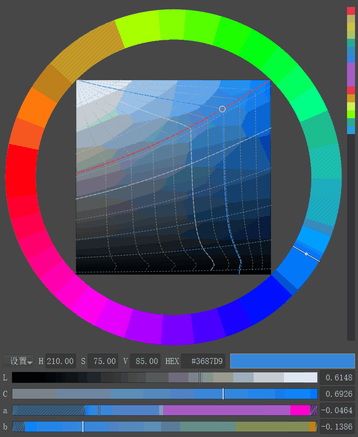

下图对比两种明度标准在 Krita 灰阶校样下的差别，第一组的彩条按灰阶定亮度，下面的灰条几乎不变；第二组的彩条按 Oklab L 定明度，下面的灰条在蓝紫一侧有点变深，这是因为 Oklab L 是感知明度，而灰阶校样看的是实际亮度，同一 Oklab L 下蓝紫色的实际亮度更低。下面左右两条演示锁定明度后的拖动：左边把 a 条从绿拖到红，右边把相对彩度从灰加到红，两种情况下下面的灰条都保持不变。

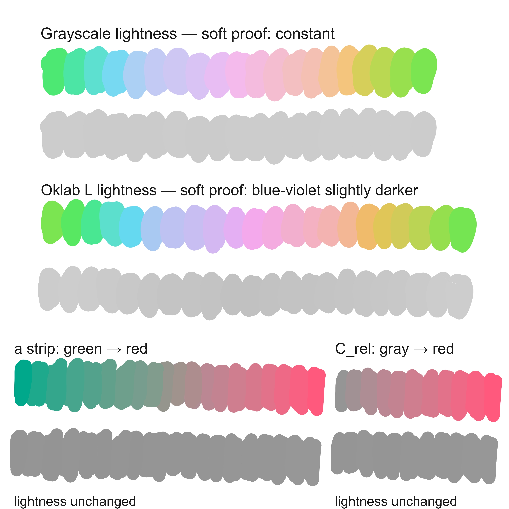

## 功能与操作

### 面板总览

既可以像普通 HSV 拾色器一样使用，也可以按 Oklab/Oklch 模式操作。

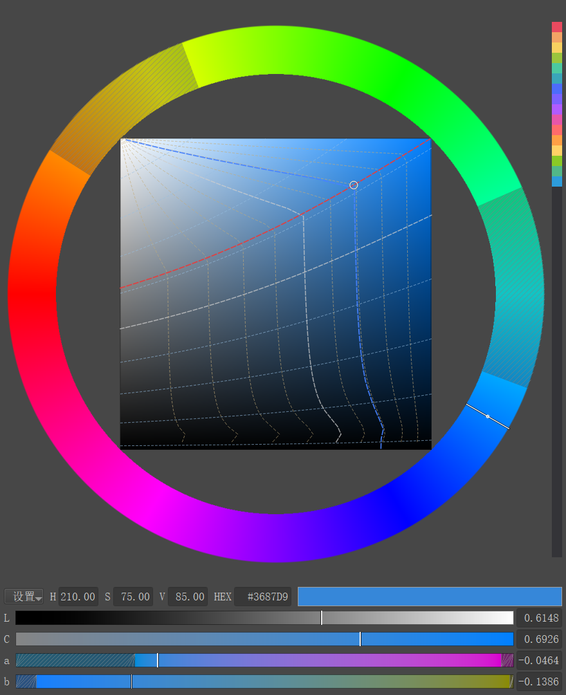

打开方式有两种：

- Docker 面板：Krita 菜单 **设置 → 面板列表 → 馍馍拾色器**。
- 弹出面板：按 `Shift+B`。

在面板里拖动色相环、S/V 方块、L/C/a/b 色条，或直接编辑数值框，都能改色。改出的颜色实时写入 Krita 前景色；用 Krita 自带拾色器或吸管改色时，面板也会同步更新。界面语言跟随 Krita（中文 / 英文），Docker 面板与弹出面板是同一套界面。

### 色相环 + S/V 方块

色相环定色相，中间的 S/V 方块定饱和度和明度，手感跟 HSV 拾色器一样。

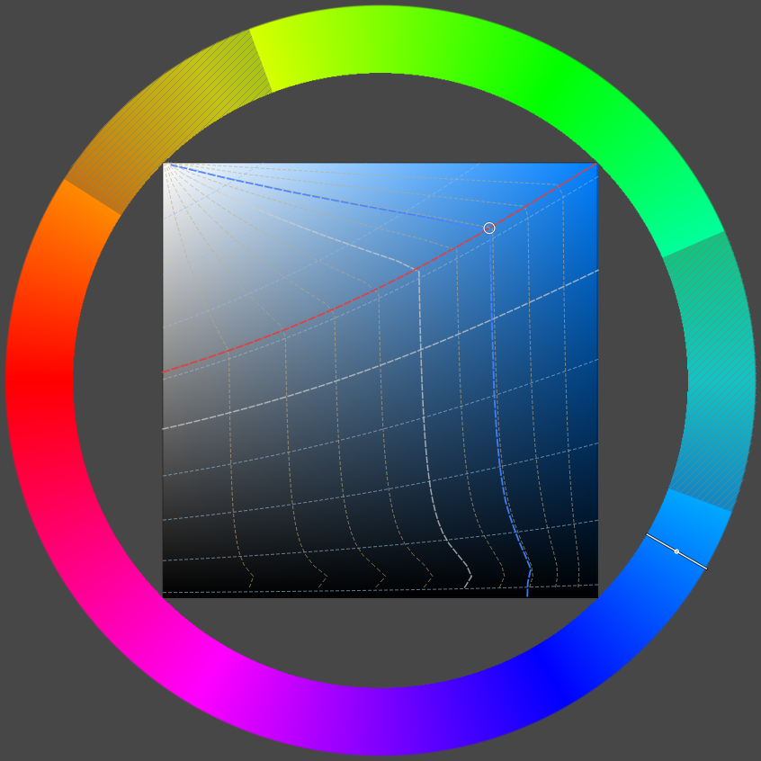

#### 色相环

- 左键 / 中键 / 右键拖：转色相 + 锁明度 L + 锁当前彩度口径。
- 目标色相够不到时，颜色停在角度最近的可达边界。
- 按住临时切换键再拖：锁另一种彩度口径，松开恢复。
- Ctrl+左键拖：只改色相，S / V 不动（纯 HSV）。
- 操作可在 **设置 → 按键功能…** 里自定义。

#### S/V 方块

- 左键：点到哪就是哪个颜色。
- 中键：沿明度轨迹改明度，锁当前彩度口径。
- 右键：沿等明度线改彩度，锁明度 L。
- 按住临时切换键再拖中 / 右键：相对拖动方式不变，彩度锁另一种口径。
- 临时期间 C 条、数值框、线簇同步切换，松开恢复。
- 只改 S / 只改 V 动作保留可选，默认不绑定。

#### 色相环的不可达色相

固定明度和**绝对彩度**后，色相环上有些角度在 sRGB 里并不存在，这些段会叠上灰色斜纹。

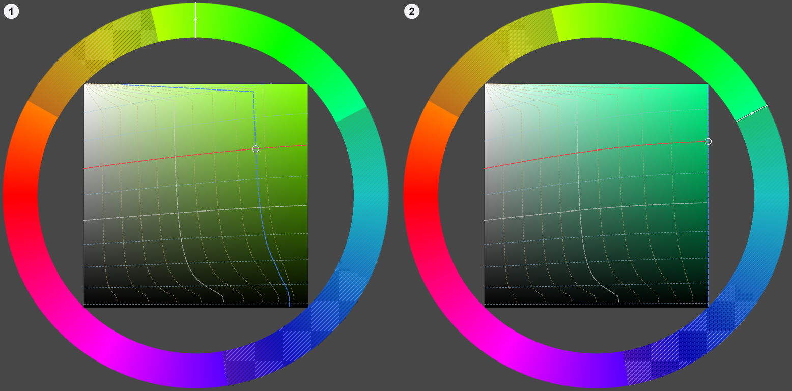

灰色斜纹段仍然可以通过左键点击和拖动（默认左键是锁定相对彩度，不受限制），用法和普通色相一样。不想看到提示时，在 **设置 → 显示不可达色相提示** 里关掉。

- 图中 ①（左）：明度和绝对彩度固定后，不同色相能达到的最大彩度不同，色域较窄的色相段会显示灰色斜纹。
- 图中 ②（右）：中键 / 右键拖进这些段时，颜色停在角度最近的可达边界，指针角度继续跟随；回到可达段颜色立刻跟上。
- 左键锁的是相对彩度，任何色相都可达到，不会出现走不动的情况。

### L / C / a / b 色条与数值框

需要精确调整明度、彩度或 Oklab 的 a、b 分量时，可以拖色条，也可以直接在数值框里键入数值。

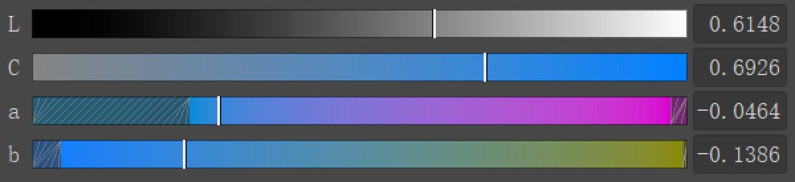

图是实际界面的 2× 整数放大，方便看清行标签和数值框里的读数。

- 四条横向色条左边是 0，按住左键拖动即可改该条的分量。
- 数值框单击编辑文本，可输入或粘贴；H / S / V 三个框还可以按住左键上下拖动连续调值。
- H / S / V 拖动倍率：默认 ×1、`Ctrl` ×2、`Ctrl+Shift` ×4、`Alt` ×0.5。
- H / S / V 三个框等宽，面板变窄时一起收缩；文本**始终完整**（H/S/V 两位小数、HEX `#RRGGBB`），不会自动变成 1 位 / 整数，也不显示省略号。宽度不足时框内改为左对齐、显示停在文本开头（优先看到整数部分），放得下时恢复右对齐。
- 宽度足够显示全部数字后，这些框不再继续变宽，多出来的宽度留给 HEX 右边的当前色块。
- 单击即可编辑完整数值；HEX 与 L / C / a / b 数值框只能输入和粘贴，不能拖动调值。

### 默认键位与自定义按键表

每个区域的鼠标键和修饰键组合都可以自己定义，改完立即生效。

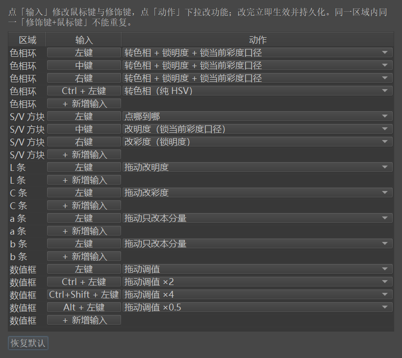

打开 **设置 → 按键功能…**，选区域、输入（鼠标键 + 8 种修饰键组合）和动作，保存即生效。

- 同区域重复输入会被拒绝。
- 「恢复默认」还原默认键位；升级不会覆盖已保存的自定义键位。
- 没有单独配置的组合，沿用该鼠标键的「无」行。

临时切换键在 **设置 → C 条选项 → 临时切换键** 里改（默认 `Shift`；支持 Ctrl / Alt / 组合键 / 无）。

按住临时切换键 + 鼠标在面板内：立即预览另一口径（蓝过点线、线簇、C 条、C 数值框同步）。
松开按键或移出面板：立即恢复持久口径，不改设置。
按住临时切换键再按方块中 / 右键、环左 / 中 / 右键：基础动作临时锁另一口径，松开恢复。
精确配置的输入行优先，不做自动翻转。

| 区域 | 可用输入 | 默认键位 |
|---|---|---|
| 色相环 | 8 种修饰键组合，各配左键、中键、右键 | 左 / 中 / 右键 = 转色相 + 锁 L + 锁当前彩度口径； Ctrl+左键 = 只改色相（纯 HSV）； 临时切换键 + 左 / 中 / 右键 = 锁另一种彩度口径 |
| S/V 方块 | 8 种修饰键组合，各配左键、中键、右键 | 左键 = 点到哪就是哪个颜色； 中键 = 改明度（锁当前彩度口径）； 右键 = 改彩度（锁 L）； 临时切换键 + 中 / 右键 = 锁另一种彩度口径； 只改 S / 只改 V 动作保留可选 |
| L / C / a / b 色条 | 8 种修饰键组合，各配左键、中键、右键 | 左键拖动 = 改该条分量； a、b 条只改本分量，明度与另一分量不动 |
| 数值框 | 8 种修饰键组合，各配左键、中键、右键 | 仅 H / S / V 三个框可拖动调值：左键 ×1； Ctrl+左键 ×2； Ctrl+Shift+左键 ×4； Alt+左键 ×0.5；单击编辑文本 |

### 弹出面板

按默认快捷键 `Shift+B` 就能在鼠标附近打开弹出面板，不必先打开 Docker 面板。

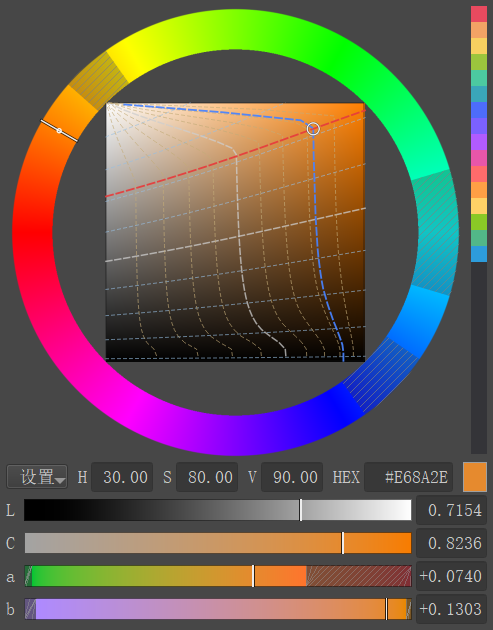

再按一次关闭；默认点击弹窗外面也会关闭，不需要时在 **设置 → 点击弹出面板外时自动关闭** 里关掉。弹窗和 Docker 面板是同一套界面，操作方式完全一样。

弹窗与 Docker 面板的颜色、数值、历史和设置实时同步。可以在设置里让弹窗保持置顶或跟随鼠标位置；弹窗超出 Krita 主窗口时会自动贴边。在文本输入框里按 `Shift+B` 只输入大写 B，不会把弹窗打开或关闭。

### 预览浮层

改色时，面板旁边会弹出一个小窗，并排对比当前颜色和最近两次用过的颜色。

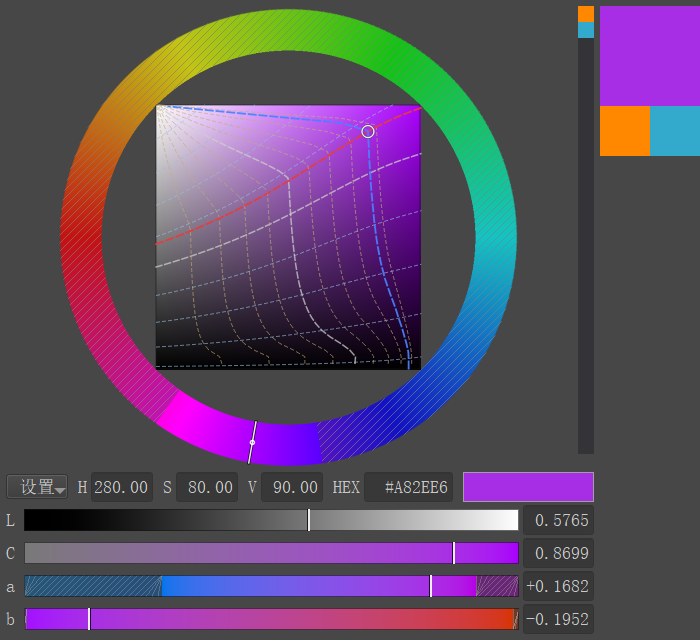

小窗是 100×150：上面 2/3 是当前选色，下面 1/3 左右并排，分别是上一次、上上次选色；选色不足两次的格子显示中灰。它贴着面板外侧显示，不挡面板和历史列，外侧放不下时自动换到另一边。

显示方式在 **设置 → 浮层选项** 里切换：

- 关闭：不显示。
- 1 秒 / 2 秒：改色时显示，松开鼠标后 1 / 2 秒消失。
- 悬停（默认）：鼠标进入拾色器就显示，移出立即消失。
- 一直：改色后保持显示。

只有在本面板里改色才会弹出；用 Krita 吸管或自带拾色器改色时不弹出。

### 历史颜色与当前色块

历史列保存最近用过的颜色，当前色块用来复制当前颜色的 HEX。历史最多保留 128 色，跨 Krita 会话保留；这是本插件自己的选色历史，不是 Krita 的系统颜色历史，需要系统颜色历史时按 `H` 打开 Krita 的「显示颜色历史」。

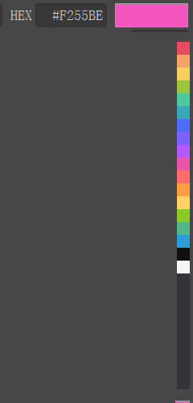

图是 HEX 数值框、当前色块与历史色块的局部拼合（实际像素）；真实界面里历史就是单列。

- 点击历史列里的色块即可取用。
- 点击 HEX 数值框右侧的色块，复制当前颜色的 `#RRGGBB`。

### 设置菜单

数值行最左边的「设置」按钮里集中了面板的显示、彩度、明度、浮层和弹窗选项。

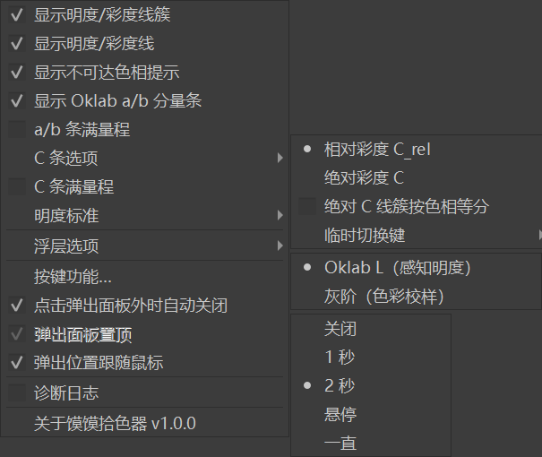

点击「设置」按钮展开菜单，逐项打开或切换。图中三个子菜单都已展开：C 条选项 = 相对 / 绝对口径、绝对 C 线簇、临时切换键；明度标准 = Oklab L（默认）/ 灰阶；浮层选项 = 关闭 / 1 秒 / 2 秒 / 悬停（默认）/ 一直。

所有设置立即生效；Docker 面板与弹窗共享同一份设置。

| 设置项 | 作用 |
|---|---|
| 显示明度/彩度线簇 | 显示两族辅助线：等明度线 9 条；等彩度线相对口径 C_rel = 0.1~0.9、绝对口径默认固定 0.02~0.36 共 18 档（可勾选「按色相等分」切成 9 档） |
| 显示明度/彩度线 | 显示红色等明度线与蓝色等彩度线；蓝线口径跟随当前生效口径（悬停/临时切换期间也跟随） |
| 显示不可达色相提示 | 在够不到的色相段叠加灰色斜纹（默认开） |
| 显示 Oklab a/b 分量条 | 显示或收起 a、b 两条色条（默认显示） |
| a/b 条满量程 | 不勾（默认）：刻度只随明度变，越界段灰色斜纹、拖到底即停；勾选：每段都可达，刻度随另一分量变 |
| C 条选项 | 相对彩度 C_rel（默认，0~1）或绝对彩度 C；切绝对后蓝过点线、彩度线簇与方块中键锁的彩度同步改用绝对 C |
| 绝对 C 线簇按色相等分 | 默认不勾：绝对口径线簇 = 固定 0.02~0.36 步长 0.02 共 18 档（够不到的明度段不画）；勾选 = 当前色相纯色 C_max(h) 的 10%~90% 共 9 档 |
| C 条满量程 | 仅绝对彩度生效：不勾（默认）固定 0~0.4；勾选后 0~当前明度与色相下的最大彩度；只影响 C 条量程，不影响线簇档位 |
| 临时切换键 | 按住即时预览另一彩度口径，按基础动作时临时锁另一口径；默认 `Shift`，可选 Ctrl / Alt / 组合键 / 无 |
| 明度标准 | Oklab L（感知明度，默认）或灰阶（色彩校样） |
| 浮层选项 | 关闭 / 1 秒 / 2 秒 / 悬停（默认）/ 一直 |
| 按键功能… | 打开自定义按键表 |
| 点击弹出面板外时自动关闭 | 默认开；关掉后点击画布不会关闭弹窗 |
| 弹出面板置顶 | 默认开；自动关闭开着时置灰 |
| 弹出位置跟随鼠标 | 默认开；超出 Krita 主窗口时自动贴边 |
| 诊断日志 | 默认关；排查问题时打开，日志写入 `%APPDATA%\krita\hsv_picker_debug.log`，每次启动 Krita 自动关闭 |
| 关于馍馍拾色器 | 版本、许可与第三方信息 |

### 明度标准：Oklab L / 灰阶

明度标准决定锁定的「明度」指什么：Oklab 感知明度，还是 Krita 灰阶校样下的灰度。

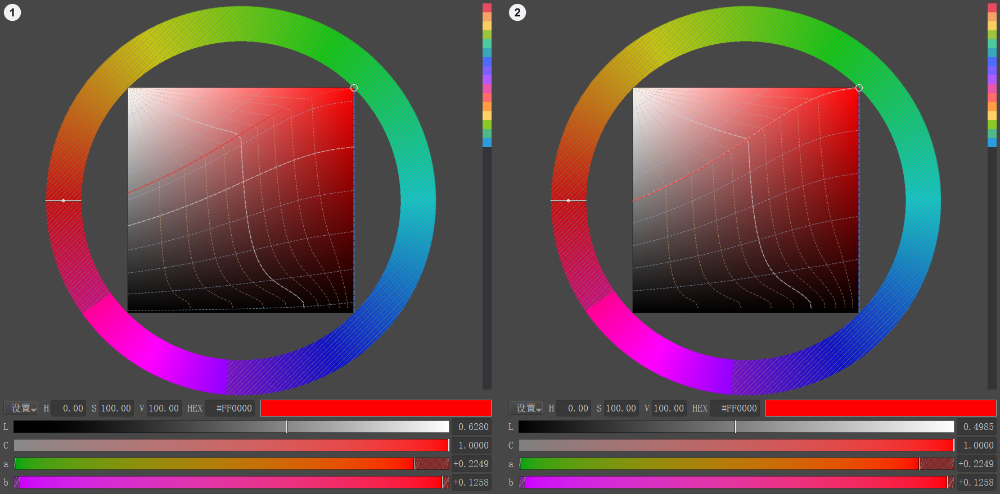

在 **设置 → 明度标准** 里二选一：Oklab L（感知明度，默认）或灰阶（色彩校样）。

- 图中 ①（左）为 Oklab L，②（右）为灰阶（色彩校样）。
- 锁 Oklab L 时，颜色的感知明度保持不变；锁灰阶时，Krita 色彩校样（色彩模型：灰阶/透明度，特性文件 `Gray-D50-elle-V2-srgbtrc.icc`）里的灰度保持不变。
- 切换只改明度相关部分：L 条、L 数值框、所有锁明度动作、等明度线，以及最大彩度和相对彩度用到的明度；色相和绝对彩度不变。
- a、b 条始终按 Oklab L 渲染；灰阶标准下拖动或输入 a、b 时锁的是灰阶，Oklab L 会跟着变化。
- 平时保持默认的 Oklab L；正在用 Krita 的灰阶校样、要求灰度准确时切灰阶。两种标准的实际差别见开头的对比图。

### 环上拖动：三种方式的差别

两张对比图展示了色相环三种拖动方式沿色相转一圈的结果，帮助判断该用哪种方式。

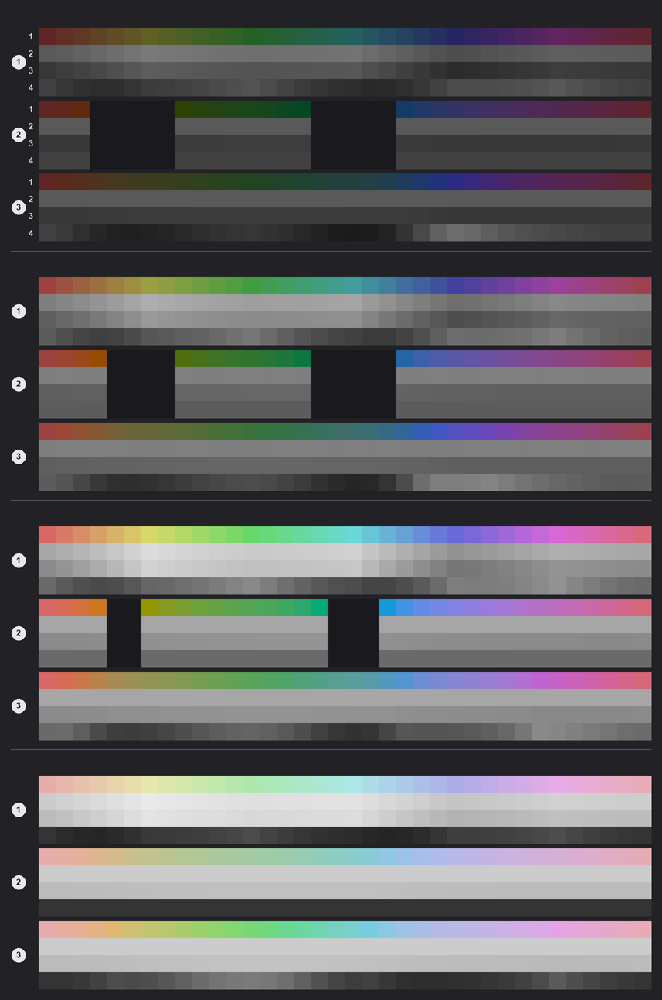

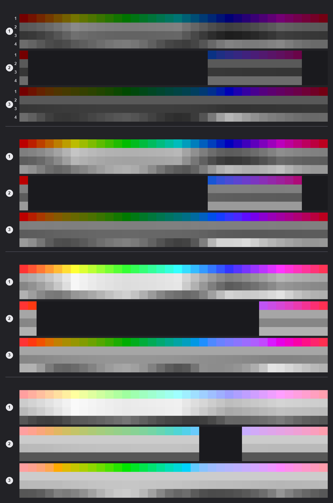

读图顺序（编号 → 含义）：

- 每张图从上到下共四组，组间有分隔线，依次是起始明度 L = 0.35 / 0.50 / 0.65 / 0.80。
- 每组三块色带，左侧圆徽 1 / 2 / 3：1 = 纯 HSV（S / V 不变）、2 = 锁明度 + 锁绝对彩度 C、3 = 锁明度 + 锁相对彩度 C_rel。
- 最上面一组的每一块，四行左侧标 1~4：1 = 实际颜色、2 = Oklab L 灰度（本插件锁的明度）、3 = Krita 灰阶校样灰度、4 = 绝对彩度 C 灰度。
- 每行 36 格 = 色相每 10° 采样；深色空格 = 该色相在当前条件下不可达。

三种方式各自的差别：

- 纯 HSV：整圈都有颜色，但明度和彩度都会随手感漂移。
- 锁绝对彩度：明度和彩度保持不动，但不可达的色相会留下中断；相对彩度 100% 那张的中断明显更多，部分明度下只有约 1/3 的色相可达。
- 锁相对彩度：整圈都可达，明度和浓淡比例都不漂移，这是默认左键采用它的原因。

### 环上拖动换色相

这张 GIF 演示在色相环上按住鼠标键拖动时，哪些量会跟着变。

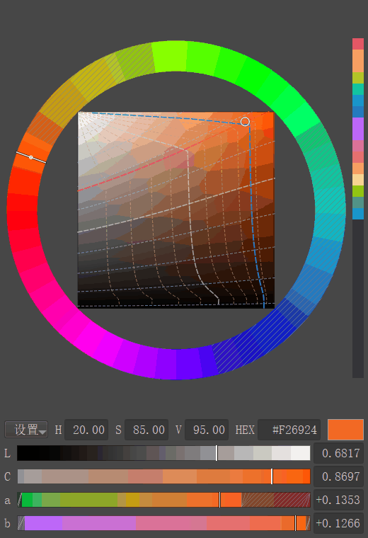

在色相环上按住左键、中键或右键拖动即可。

- 左键：色相在变，明度和浓淡比例（相对彩度）不变。
- 中键 / 右键：色相在变，明度和绝对彩度不变；够不到时颜色停在角度最近的可达边界。

### a / b 色条拖动

这张 GIF 演示单独微调 Oklab 的 a、b 两个分量。

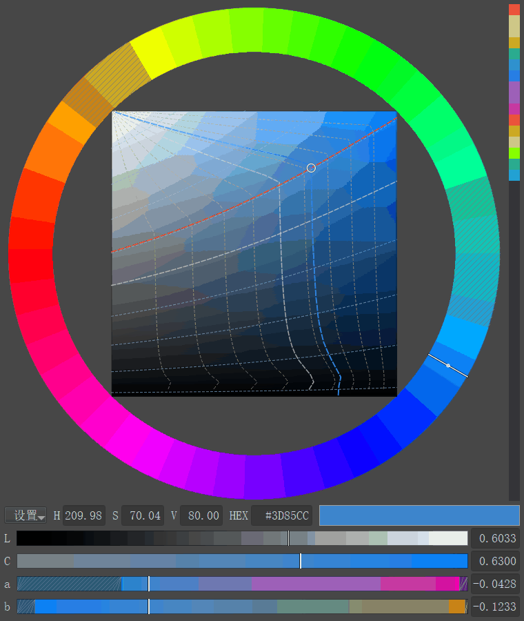

在 a 条或 b 条上按住左键拖动即可。

拖动只改本分量，明度和另一个分量保持不动；色相环游标、方块色点和其他色条同步显示同一个颜色。

## 安装

> 插件需要 numpy，对于 Windows11 + krita5.3.x 只需要这一个 zip，发布包已经内置 numpy，不需要另外安装。

1. 打开 [Releases](https://github.com/zmom0/momo-color-picker/releases)，下载最新的 `MomoColorPicker-<版本>-win64-krita5.3.zip`。
2. 打开 Krita，点 **工具 → 脚本 → 从文件导入 Python 插件…**（`Tools > Scripts > Import Python Plugin From File...`）。
3. 选中刚下载的 zip 文件。
4. Krita 提示需要重启才能启用插件时，选 **Yes**。
5. 重启 Krita，然后打开 **设置 → 面板列表 → 馍馍拾色器**，或按 `Shift+B`。

## 兼容性

- **支持**：Krita **5.3.x** + **Windows**（当前实际测试环境）。
- **其他平台**：不保证可用。想在其它平台使用，需要自行把 numpy 安装到 Krita 使用的 Python 环境；Windows 发布包内置的 numpy 不适用于其它平台。
- Windows 发布包内置 numpy 2.3.0，不需要单独安装 Python 或 numpy。
- Krita 5.2 及更早版本未测试。

## 常见问题（FAQ）

1. **为什么明度到不了 1.0？**
   固定彩度时明度有物理上限：越接近白色，颜色必须越接近中性灰。明度条在亮端会自动降低彩度；要到 L = 1.0，需要把彩度降到 0（纯白）。

2. **为什么色相环上有些角度颜色不动？**
   中键 / 右键锁的是「明度 L + 绝对彩度 C」；固定这两个量后，sRGB 里只有一部分色相存在。指针角度继续跟手，颜色停在角度最近的可达边界，转回可达范围就立刻跟上。想整圈都顺畅，用左键（锁相对彩度）。

3. **相对彩度和绝对彩度怎么选？**
   日常选色用相对彩度（默认）：浓淡比例稳定，任何色相和明度都可达，数值 0~1 直观。需要固定「离灰轴的距离」时（复现色板、按绝对彩度做渐变），在 **设置 → C 条选项** 切成绝对彩度；切过去后部分色相到不了，量程可选固定 0~0.4 或 0~当前最大彩度（C 条满量程）。

4. **切到灰阶后拖 a、b，为什么 Oklab L 会变？**
   灰阶标准锁的是灰阶值；a、b 改变时，要让灰阶严格不变，Oklab L 就必须跟着变。想锁 Oklab L，把 **设置 → 明度标准** 切回 Oklab L。

5. **为什么插件包有几十 MB？**
   Windows 发布包内置 numpy 2.3.0（BSD-3-Clause）；Krita 内嵌的 Python 没有 numpy，内置它才能做到下载 zip、导入即可用。

6. **`Shift+B` 和别的功能冲突怎么办？**
   打开 **设置 → 配置 Krita → 快捷键 → 脚本 →「Show Momo Color Picker」**，改成别的组合即可；插件跟随这个快捷键，`Shift+B` 只是默认值。

7. **安装后在哪儿打开插件？**
   **设置 → 面板列表 → 馍馍拾色器**；也可以按 `Shift+B` 弹出面板。如果面板列表里没有，到 **设置 → 配置 Krita → Python 插件管理器** 确认插件已勾选，然后重启 Krita。

8. **怎么卸载？**
   **设置 → 配置 Krita → Python 插件管理器**，取消勾选「馍馍拾色器」并重启 Krita 即可停止加载；要彻底删除，再删掉 `pykrita/hsv_picker.desktop`、`pykrita/hsv_picker/` 和 `%APPDATA%\krita\actions\hsv_picker.action`。

## 概念

### Oklab 与 Oklch

- **Oklab**：感知均匀的颜色空间，三个分量是 L（感知明度，0 黑、1 白，与色相无关）、a（绿 ↔ 红）、b（蓝 ↔ 黄）。
- **Oklch**：Oklab 的极坐标写法（L、C、h）：`C = √(a² + b²)`，`h = atan2(b, a)`。
- **为什么需要**：在 Oklab 里调整明度和彩度更接近眼睛的感受，跨色相、跨明度比较颜色时不容易失真。
- **本插件怎么用**：色相用 HSV 的 H，明度和彩度用 Oklab 的 L 和 C 来锁定与读数，所以是「HSV 手感 + Oklab 精确控制」。插件里的 H 是 HSV 色相，与 Oklch 的 h 通常不是同一个数值。

### sRGB 与输出

- 插件写回 Krita 的是 8bit sRGB（HEX `#RRGGBB`）。色相环上的「不可达」和 a、b 条的可达范围，都由 sRGB 色域决定。
- 写回时数值会量化到 8bit，所以反复输入、读回时可能出现末位的小误差。

### HSV 与 H / S / V

- H = 色相角（0° 红在 9 点钟、顺时针）、S = 饱和度、V = 明度，也就是色相环和 S/V 方块的操作语言。
- 用它的原因：手感直观，人人熟悉；插件的锁定目标再换成 Oklab 的 L 与 C，兼顾熟悉操作和感知准确。

### 绝对彩度 C

- **是什么**：颜色到中性灰轴的 Oklab 距离，`C = √(a² + b²)`；0 就是灰轴。
- **为什么不用 HSV 的 S**：S 依赖 V，同一个 S 在不同明度下浓淡观感不同；C 跨明度更可比。
- **什么时候用**：需要固定「离灰轴多远」时，例如复现色板、按绝对彩度做渐变。C 的上限随明度和色相变化，越接近黑、白越小。

### 最大彩度与相对彩度 C_rel

- **最大彩度 C_max(L, h)**：同一色相、同一明度下，sRGB 能达到的最大绝对彩度。
- **相对彩度 C_rel = C / C_max(L, h)**：0 = 灰轴，1 = 该明度、该色相下最浓。
- **为什么需要它**：
  - 绝对彩度的上限随明度和色相剧烈变化，同一个 C 在明度 0.2 和 0.8 下浓淡差很多，没法直接比较；
  - HSV 的 S 又依赖 V，跨明度也不可比；
  - C_rel 把彩度变成「还能有多浓的比例」，跨明度、跨色相都能比较。
- **好处**：
  - 锁 C_rel 拖明度：浓淡比例恒定，不会中途突然变灰或变艳；
  - 色相环左键锁 C_rel：转色相时浓淡比例不变；
  - 数值在 0~1 之间，永远不会溢出 sRGB；
  - 等相对彩度线可以作为配色时的视觉参考。
- **什么时候改用绝对彩度**：需要固定「到灰轴的距离」而不是比例时（复现色板、按绝对彩度做渐变）。色相环中键 / 右键默认锁绝对彩度，彩度条可在设置里切换。锁定明度、只改相对彩度时明度不变的效果见开头的对比图（右下）。

### 不可达色相

- **是什么**：固定明度 L 与绝对彩度 C 后，满足 `C > C_max(L, h)` 的色相在 sRGB 里不存在。
- **为什么会有**：sRGB 色域不是按色相均匀的圆柱，各色相能到的最大彩度不同，色相是有限的。
- **什么时候会遇到**：绝对彩度较大、明度接近黑、白，或色相落在色域较窄的区段；这时环上会出现灰色斜纹。

### 轨迹线、线簇与锁定

- **红色等明度线**：固定明度，颜色在 S/V 与 C/H 里的运行轨迹；**蓝色等彩度线**：固定彩度的轨迹线，口径跟随当前生效口径（相对 = C_rel，绝对 = 绝对 C；临时切换期间也跟随）。
- **线簇**：10%~90% 的两族虚线，只作视觉参考，可在设置里关掉。
- **锁定**：锁 L 固定感知明度，锁 C_rel 固定浓淡比例，锁绝对 C 固定到灰轴的距离；锁定时一条轨迹线冻结，另一条继续实时更新。
- a、b 条拖动期间两条线都实时。

### a / b 分量条

- a、b 是 Oklab 的两个对立轴（绿 ↔ 红、蓝 ↔ 黄），直接调整它们可以微调感知色度。
- 量程有两种（**设置 → a/b 条满量程**）：不勾（默认）量程只随明度变，刻度稳定，越界段画灰色斜纹、拖到底即停；勾选后每段都可达，但刻度会随另一个分量变。
- 拖动 a 或 b 只改本分量，明度和另一个分量不动；明度标准切到灰阶时，锁的是灰阶而不是 Oklab L。锁定明度拖动的效果见开头的对比图（左下）。

### 明度标准：Oklab L 与灰阶

- **Oklab L（默认）**：感知明度，0 黑、1 白，与色相无关。
- **灰阶（色彩校样）**：Krita 色彩校样设为「色彩模型：灰阶/透明度、特性文件 `Gray-D50-elle-V2-srgbtrc.icc`」时，那张灰块的灰度值。它按线性 sRGB 的相对亮度（0.2126729 R + 0.7151522 G + 0.0721750 B，归一到纯白 = 1）再经 sRGB 编码得到，和 Oklab L 不是一回事。
- **为什么需要灰阶**：用 Oklab L 锁定的颜色，在灰阶校样下的灰度可能和预期不同；要保证校样灰度不变，就用灰阶标准。
- **怎么选**：平时绘画、取色用 Oklab L（默认）；正在用 Krita 的灰阶校样、要求灰度准确时切灰阶；不确定就保持默认。
- **切换影响**：L 条、L 数值框、所有锁明度动作、等明度线，以及最大彩度和相对彩度用到的明度都会换成新标准；色相和绝对彩度不变。a、b 条的渲染轴始终是 Oklab L。

### 数值与格式

- H / S / V 显示两位小数；L / C / a / b 显示四位小数，a、b 带符号。
- HEX 大写，格式 `#RRGGBB`。
- 色条坐标是线性的，游标位置和数值框始终一致。

### 历史与系统历史

- 面板里的历史是本插件自己的选色历史，最多 128 色，单列显示，跨 Krita 会话保留。
- 它不是 Krita 的系统颜色历史；需要 Krita 的系统颜色历史时，按 `H`。

## 许可与第三方

- **本插件**：GPL-3.0-or-later
- **numpy 2.3.0**：BSD-3-Clause。许可全文随发布包保留在 `pykrita/hsv_picker/vendor/numpy-2.3.0.dist-info/LICENSE.txt`。

## 链接

- 仓库：<https://github.com/zmom0/momo-color-picker>
- Releases：<https://github.com/zmom0/momo-color-picker/releases>

## English

### Momo Color Picker: a more HSV-friendly Oklab/Oklch picker

Momo Color Picker: an HSV-style picker that also works in Oklab/Oklch mode.

The hue ring, SV square, L/C/a/b strips, value fields, pick history and custom keys are all in one panel, and lightness and chroma can be locked to Oklab L and C.

The chart below compares the two lightness standards under Krita's grayscale soft proof: the first pair has a constant grayscale value (its soft-proof gray stays almost flat); the second pair has a constant Oklab L (its soft-proof gray gets a little darker towards blue-violet, because Oklab L is perceptual lightness while the soft-proof gray follows actual luminance — at the same Oklab L, blue-violet hues have lower luminance). The two strips below (left and right) show locked-lightness drags — left: the a strip from green to red; right: relative chroma from gray to red — in both cases the gray strip below stays unchanged.

### Controls

#### Panel overview

Use it like an ordinary HSV picker, or work in Oklab/Oklch mode.

Open it in two ways:

- Docker panel: Krita menu **Settings → Dockers → Momo Color Picker**.
- Popup panel: press `Shift+B`.

In the panel, drag the hue ring, the SV square or the L/C/a/b strips, or edit the value fields directly. The color you pick is written to Krita's foreground in real time, and the panel follows when you change the color with Krita's own picker or the color sampler. The UI follows Krita's language (Chinese / English), and the Docker panel and the popup are the same interface.

#### Hue ring + SV square

The ring sets the hue and the square in the middle sets saturation and value, with the familiar HSV feel.

##### Hue ring

On the ring, 0° red is at 9 o'clock and the angle increases clockwise.

- Left / middle / right-drag: rotate the hue + lock lightness L + lock the current chroma scale.
- If the target hue cannot reach that chroma, the color stops at the angularly nearest reachable boundary.
- Hold the temporary switch key and drag: lock the other chroma scale; release to restore.
- Ctrl+left-drag: change the hue only, keeping S and V as they are (plain HSV).
- Every action can be reassigned in **Settings > Key functions...**.

##### SV square

The square's corners touch the ring's inner circle, so the four gaps between them also work like the ring.

- Left button: the color under the pointer.
- Middle button: change lightness along its trajectory, locking the current chroma scale.
- Right button: change chroma along the equal-lightness line, locking L.
- Hold the temporary switch key and drag middle / right: same relative dragging, but the chroma locks the other scale.
- The C strip, value field and clusters follow that scale during the switch and return on release.
- S-only / V-only actions remain selectable but are no longer bound by default.

##### Unreachable hues on the ring

Once lightness and **absolute chroma** are fixed, some angles on the ring do not exist in sRGB; those spans get a gray hatch.

Hatched spans can still be clicked and dragged with the left button (the left button locks relative chroma, which is not limited), just like ordinary hues. To hide the hint, turn off **Settings → Show unreachable hue hint**.

- ① (left): with lightness and absolute chroma fixed, each hue reaches a different maximum chroma, so hues with a narrower gamut show the gray hatch.
- ② (right): when you middle/right-drag into one of those spans, the color stops at the angularly nearest reachable boundary while the pointer keeps tracking your angle; back in the reachable spans, the color follows at once.
- The left button locks relative chroma, which every hue can reach, so it never gets stuck.

#### L / C / a / b strips + value fields

To fine-tune lightness, chroma or the Oklab a/b components precisely, drag a strip or type a value directly.

The image is a 2× integer enlargement of the real interface, so the row labels and field readings are easy to read.

- The four horizontal strips have 0 at the left; hold the left button and drag to change that component.
- Click a value field to edit its text, or type and paste into it; the H / S / V fields can also be adjusted by holding the left button and dragging vertically.
- Drag multipliers for H / S / V: 1× by default, 2× with `Ctrl`, 4× with `Ctrl+Shift`, 0.5× with `Alt`.
- The H / S / V fields share one width and shrink together as the panel narrows, but their text always stays complete (two decimals for H / S / V, the full `#RRGGBB` for HEX): no dynamic decimals and no ellipsis. When a field is too narrow it switches to left alignment and stays at the beginning of the text (the integer part is visible first); it returns to right alignment once the full text fits. Once the fields fit all their digits they stop growing; the extra width goes to the current-color swatch on the right.
- Click any field to edit the complete value. The HEX and L / C / a / b fields only accept typing and pasting; they cannot be drag-adjusted.

#### Default keys + custom key table

Every area can use the mouse buttons and modifier keys you like, and changes take effect right away.

Open **Settings → Key functions...**, choose an area, an input (mouse button + 8 modifier combinations) and an action; changes save and apply immediately.

- A duplicate input in the same area is rejected.
- Restore defaults brings back the default table; a saved custom table is never overwritten by an update.
- A combination that is not configured falls back to the plain (no modifier) row of the same mouse button.

Change the temporary switch key in **Settings → C strip options → Temporary switch key** (default `Shift`; Ctrl / Alt / combinations / none).

Hold the temporary switch key with the pointer on the panel: preview the other chroma scale immediately (blue through-line, clusters, C strip, C value field).
Release the key or leave the panel: restore the persistent scale without changing settings.
Hold the switch key and press a square middle/right or ring left/middle/right button: the base action locks the other scale until release.
An exact configured input row wins; no auto flip.

| Area | Available inputs | Default keys |
|---|---|---|
| Hue ring | 8 modifier combinations, each with left, middle and right button | Left / middle / right = rotate hue + lock L + lock the current chroma scale; Ctrl+left = rotate hue only (plain HSV); temporary switch key + left / middle / right = lock the other chroma scale |
| SV square | 8 modifier combinations, each with left, middle and right button | Left = the color under the pointer; middle = change lightness (locks the current chroma scale); right = change chroma (locks L); temporary switch key + middle / right = lock the other chroma scale; S-only / V-only actions remain selectable |
| L / C / a / b strips | 8 modifier combinations, each with left, middle and right button | Left-drag = change that component; on the a and b strips only that component changes, lightness and the other component stay put |
| Value fields | 8 modifier combinations, each with left, middle and right button | Only the H / S / V fields can be drag-adjusted: left-drag x1; Ctrl+left x2; Ctrl+Shift+left x4; Alt+left x0.5; click to edit the text |

#### Popup panel

Press the default shortcut `Shift+B` to open the popup near the mouse, without opening the Docker panel first.

Press it again to close. By default, clicking outside the popup also closes it; turn that off in **Settings → Auto-close popup when clicking outside**. The popup is the same interface as the Docker panel and works the same way.

The popup and the Docker panel stay in sync for color, values, history and settings. You can keep the popup always on top or let it follow the mouse, and it clamps back inside the Krita main window when it would go outside. Pressing `Shift+B` inside a text field only types an uppercase B; it never opens or closes the popup.

#### Preview overlay

While you adjust a color, a small window appears next to the panel and compares the current color with the last two you picked.

The window is 100×150: the top 2/3 shows the current color and the bottom 1/3 is split into two squares, left for the last picked color and right for the one before it; a slot with no color yet shows mid gray. It sits just outside the panel without covering the panel or the history column, and flips to the other side when there is not enough room.

Choose the display mode in **Settings → Overlay options**:

- Off: never shown.
- 1 second / 2 seconds: shown while you change the color and hidden 1 / 2 seconds after you release.
- Hover (default): shown when the mouse enters the picker and hidden the moment it leaves.
- Always: stays visible after a color change.

It only appears for changes made in this panel; using Krita's color sampler or its own picker does not trigger it.

#### History + current-color swatch

The history column brings back recently used colors, and the current-color swatch copies the current HEX value. History keeps up to 128 colors and survives Krita sessions; this is the picker's own color history, not Krita's system color history — for that, press `H` to open Krita's Show Color History.

The image is a composite of the HEX field, the current-color swatch and the history column at actual pixels; in the real interface the history is a single column.

- Click a swatch in the history column to pick that color.
- Click the swatch to the right of the HEX field to copy the current `#RRGGBB`.

#### Settings menu

The Settings button at the far left of the value row gathers the panel's display, chroma, lightness, overlay and popup options.

Click Settings to open the menu, then turn items on or switch between them. The image shows all three submenus expanded: C strip options = Relative / Absolute, absolute C clusters, temporary switch key; Lightness standard = Oklab L (perceptual, default) / Grayscale (soft proof); Overlay options = Off / 1 second / 2 seconds / Hover (default) / Always.

Every setting takes effect immediately, and the Docker panel and the popup share the same settings.

| Setting | Effect |
|---|---|
| Show lightness/chroma cluster lines | Show equal-lightness lines plus equal-chroma lines: relative C_rel = 0.1-0.9; absolute defaults to the fixed 0.02-0.36 set (18 levels), switchable to 9 levels at 10%-90% of the pure-color C_max(h) |
| Show lightness/chroma through-lines | Show the red equal-lightness and blue equal-chroma lines; the blue line follows the effective scale (including hover/temporary switch) |
| Show unreachable hue hint | Add a gray hatch over hues that cannot be reached (on by default) |
| Show Oklab a/b strips | Show or hide the a and b strips (shown by default) |
| a/b strips full range | Off (default): the scale follows lightness only, out-of-range spans are hatched and dragging stops at the end; On: every span is reachable, but the scale follows the other component |
| C strip options | Relative chroma C_rel (default, 0-1) or absolute chroma C; in absolute mode the blue through-line, chroma clusters and the square's middle-button lock all switch to absolute C |
| Even absolute C clusters by hue | Off (default): fixed 0.02-0.36 in 0.02 steps (18 levels; unreachable lightness spans are skipped); on: 9 levels at 10%-90% of the pure-color C_max(h) for the current hue |
| C strip full range | Absolute chroma only: off (default) fixes the range at 0-0.4; on makes it 0 to the maximum chroma at the current lightness and hue; it affects the strip range only, not the cluster values |
| Temporary switch key | Hold to preview the other chroma scale; base actions lock the other scale while held. Default `Shift`; Ctrl / Alt / combinations / none |
| Lightness standard | Oklab L (perceptual, default) or Grayscale (soft proof) |
| Overlay options | Off / 1 second / 2 seconds / Hover (default) / Always |
| Key functions... | Open the custom key table |
| Auto-close popup when clicking outside | On by default; when off, clicking the canvas does not close the popup |
| Keep popup always on top | On by default; greyed out while auto-close is on |
| Popup at mouse position | On by default; clamps back inside the Krita main window when it would overflow |
| Diagnostic log | Off by default; turn it on when troubleshooting; writes `%APPDATA%\krita\hsv_picker_debug.log` and turns itself off on every Krita start |
| About Momo Color Picker | Version, license and third-party notices |

#### Lightness standard: Oklab L / Grayscale

The lightness standard decides what "lightness" means when locking: Oklab perceptual lightness, or the gray value in Krita's grayscale soft proof.

Choose one in **Settings → Lightness standard**: Oklab L (perceptual, default) or Grayscale (soft proof).

- ① (left) is Oklab L and ② (right) is Grayscale (soft proof).
- With Oklab L locked, the perceptual lightness stays constant; with Grayscale locked, the gray value stays constant in Krita's soft proof (Color model: Grayscale/Alpha, profile `Gray-D50-elle-V2-srgbtrc.icc`).
- Switching changes only the lightness-related parts: the L strip, the L field, every lock-lightness action, the equal-lightness lines and the lightness used by maximum and relative chroma; hue and absolute chroma are unchanged.
- The a and b strips are always rendered on Oklab L; under Grayscale, dragging or typing a and b locks the gray value, so Oklab L changes with it.
- Keep the default Oklab L for everyday work; switch to Grayscale while working with the grayscale soft proof and needing an accurate gray. See the comparison chart at the top for the actual difference between the two standards.

#### Ring drag: the three modes compared

The two charts compare the three ring drag modes over a full turn of hue, to help you decide which one to use.

Read them by the numbers:

- Each chart has four groups from top to bottom, separated by divider lines, with starting lightness L = 0.35 / 0.50 / 0.65 / 0.80.
- Each group has three blocks, marked 1 / 2 / 3 by the round badges on the left: 1 = plain HSV (S / V unchanged), 2 = lock lightness + lock absolute chroma C, 3 = lock lightness + lock relative chroma C_rel.
- In the top group, the four rows of every block are numbered 1~4 on the left: 1 = actual color, 2 = Oklab L gray (the lightness this plugin locks), 3 = Krita soft-proof gray, 4 = absolute chroma C gray.
- Each row has 36 cells, the hue sampled every 10°; a dark gap means that hue does not exist under those conditions.

How the three modes differ:

- Plain HSV: every hue has a color, but lightness and chroma drift with the pointer.
- Lock absolute chroma: lightness and chroma stay put, but unreachable hues leave breaks in the band; the 100% relative-chroma chart has many more breaks, and at some lightness levels only about a third of the hues are reachable.
- Lock relative chroma: every hue stays reachable, and neither lightness nor the saturation ratio drifts, which is why the left button uses it by default.

#### Hue drag on the ring

This GIF shows which quantities follow when you drag on the ring.

Hold the left, middle or right button on the ring and drag.

- Left button: the hue changes while lightness and the saturation ratio (relative chroma) stay constant.
- Middle / right button: the hue changes while lightness and absolute chroma stay constant; when the target is unreachable, the color stops at the angularly nearest reachable boundary.

#### Dragging the a / b strips

This GIF shows how to fine-tune the Oklab a and b components one at a time.

Hold the left button on the a strip or the b strip and drag.

Only the dragged component changes; lightness and the other component stay put, and the ring cursor, the square's color point and the other strips all follow the same color.

### Installation

> The plugin needs numpy. On Windows 11 + Krita 5.3.x one zip is all you need: numpy is already bundled, so nothing else has to be installed.

1. Open [Releases](https://github.com/zmom0/momo-color-picker/releases) and download the latest `MomoColorPicker-<version>-win64-krita5.3.zip`.
2. In Krita, open **Tools → Scripts → Import Python Plugin From File...**.
3. Select the zip file you just downloaded.
4. When Krita says the plugin needs a restart to be enabled, choose **Yes**.
5. Restart Krita, then open **Settings → Dockers → Momo Color Picker**, or press `Shift+B`.

### Compatibility

- **Supported:** Krita **5.3.x** on **Windows** (the environment this build is tested on).
- **Other platforms:** not guaranteed. To try them, install numpy into the Python environment used by Krita; the numpy bundled in the Windows package does not apply to other platforms.
- The Windows package bundles numpy 2.3.0, so no separate Python or numpy install is needed.
- Krita 5.2 and older are untested.

### FAQ

1. **Why can't I reach lightness 1.0?** With chroma fixed there is a physical limit: the closer a color gets to white, the closer it must be to neutral gray. The lightness strip reduces chroma near the bright end; reaching L = 1.0 requires chroma 0 (pure white).

2. **Why does the color not move at some angles on the ring?** The middle / right button locks lightness L + absolute chroma C; with both fixed, only some hues exist in sRGB. The pointer keeps tracking your angle while the color stops at the angularly nearest reachable boundary, and follows again as soon as you get back. Use the left button (locks relative chroma) if you want a smooth full turn.

3. **Relative or absolute chroma: which should I use?** Use relative chroma (the default) for everyday picking: the saturation ratio is stable, every hue and lightness is reachable, and the 0-1 scale is easy to read. Switch to absolute chroma in **Settings → C strip options** when you need a fixed distance from the gray axis (reproducing a palette, gradients by absolute chroma); some hues then become unreachable, and the range can be the fixed 0-0.4 or 0 to the current maximum (C strip full range).

4. **Under Grayscale, why does Oklab L change when I drag a / b?** The Grayscale standard locks the gray value; to keep it exactly constant while a or b changes, Oklab L has to move. Switch **Settings → Lightness standard** back to Oklab L if you want to lock Oklab L.

5. **Why is the package tens of MB?** The Windows package bundles numpy 2.3.0 (BSD-3-Clause); Krita's embedded Python has no numpy, and bundling it is what makes "download the zip, import, use" work.

6. **What if `Shift+B` conflicts with something else?** Open **Settings → Configure Krita → Shortcuts → Scripts → "Show Momo Color Picker"** and pick another combination; the plugin follows that shortcut, and `Shift+B` is only the default.

7. **Where do I find the plugin after installing it?** **Settings → Dockers → Momo Color Picker**, or press `Shift+B` to pop up the panel. If it is not in the docker list, check **Settings → Configure Krita → Python Plugin Manager**, make sure the plugin is enabled, and restart Krita.

8. **How do I uninstall it?** In **Settings → Configure Krita → Python Plugin Manager**, uncheck Momo Color Picker and restart Krita to stop loading it; to remove it completely, also delete `pykrita/hsv_picker.desktop`, `pykrita/hsv_picker/` and `%APPDATA%\krita\actions\hsv_picker.action`.

### Concepts

#### Oklab and Oklch

- **Oklab** is a perceptually uniform color space with three components: L (perceptual lightness, 0 black and 1 white, independent of hue), a (green ↔ red) and b (blue ↔ yellow).
- **Oklch** is the polar form of Oklab (L, C, h): `C = √(a² + b²)` and `h = atan2(b, a)`.
- **Why it is needed:** adjusting lightness and chroma in Oklab matches human perception much better, so colors stay comparable across hues and lightness levels.
- **How this plugin uses it:** hue comes from HSV H, while lightness and chroma are locked and read as Oklab L and C, i.e. "HSV feel + Oklab precision". The H in the plugin is the HSV hue, which is usually a different number from Oklch's h.

#### sRGB and output

- The plugin writes 8-bit sRGB back to Krita (HEX `#RRGGBB`). The "unreachable" spans on the ring and the reachable range of the a / b strips are both decided by the sRGB gamut.
- Values are quantized to 8 bits on the way back, so repeated typing and reading may show a tiny last-digit difference.

#### HSV and H / S / V

- H = hue angle (0° red at 9 o'clock, increasing clockwise), S = saturation, V = value; this is the operating language of the hue ring and the SV square.
- Why use it: the feel is intuitive and familiar; the plugin then changes the lock targets to Oklab L and C, combining familiar controls with perceptual accuracy.

#### Absolute chroma C

- **What it is:** the Oklab distance from the neutral gray axis, `C = √(a² + b²)`; 0 is the gray axis.
- **Why not HSV S:** S depends on V, so the same S does not mean the same amount of saturation at different lightness levels; C is comparable across lightness.
- **When to use it:** when you need a fixed distance from the gray axis, for example reproducing a palette or building gradients by absolute chroma. The maximum C varies with lightness and hue and shrinks near black and white.

#### Maximum chroma and relative chroma C_rel

- **Maximum chroma C_max(L, h):** the largest absolute chroma sRGB can reach at the same hue and lightness.
- **Relative chroma C_rel = C / C_max(L, h):** 0 = gray axis, 1 = the most saturated color at that lightness and hue.
- **Why it is needed:**
  - the maximum absolute chroma varies strongly with lightness and hue, so the same C looks completely different at lightness 0.2 and 0.8 and cannot be compared directly;
  - HSV S depends on V and is not comparable across lightness either;
  - C_rel turns chroma into "how much of the available saturation" and makes it comparable across lightness and hue.
- **Benefits:**
  - lock C_rel and drag lightness: the saturation ratio stays constant and never jumps to gray or to over-saturated;
  - ring left button locks C_rel: the saturation ratio stays the same while the hue rotates;
  - the value stays in 0-1, so it can never leave the sRGB gamut;
  - the equal-relative-chroma lines work as a visual reference for palettes.
- **When to switch to absolute chroma:** when you need a fixed distance from the gray axis rather than a ratio (reproducing a palette, gradients by absolute chroma). The ring's middle / right buttons lock absolute chroma by default, and the C strip can be switched in the settings. The bottom-right demo in the comparison chart at the top shows that raising relative chroma with lightness locked leaves the gray strip unchanged.

#### Unreachable hues

- **What it is:** with lightness L and absolute chroma C fixed, hues where `C > C_max(L, h)` do not exist in sRGB.
- **Why it happens:** the sRGB gamut is not a hue-uniform cylinder; the maximum chroma differs from hue to hue, so the available hues are limited.
- **When you meet it:** at larger absolute chroma, lightness near black or white, or hues in the narrower parts of the gamut; the ring then shows the gray hatch.

#### Trajectory lines, clusters and locking

- **Red equal-lightness line:** the path of colors with fixed lightness in S/V and C/H; **blue equal-chroma line:** the path of constant chroma, following the effective scale (relative = C_rel, absolute = absolute C; the temporary switch also applies).
- **Clusters:** two families of dashed lines from 10% to 90%, for visual reference only; they can be turned off in the settings.
- **Locking:** lock L fixes perceptual lightness, lock C_rel fixes the saturation ratio, lock absolute C fixes the distance from the gray axis; while locked, one trajectory line freezes and the other keeps updating.
- While dragging the a / b strips, both lines stay live.

#### The a / b strips

- a and b are the two opposite axes of Oklab (green ↔ red, blue ↔ yellow); adjusting them directly fine-tunes the perceived color components.
- Two ranges (**Settings → a/b strips full range**): off (default) keeps the scale tied to lightness only, with stable ticks, hatched out-of-range spans and dragging that stops at the end; on makes every span reachable, but the scale follows the other component.
- Dragging a or b changes only that component; lightness and the other component stay put. With the Grayscale lightness standard the locked quantity is the gray value, not Oklab L. See the bottom-left demo in the comparison chart at the top.

#### Lightness standard: Oklab L and Grayscale

- **Oklab L (default):** perceptual lightness, 0 black and 1 white, independent of hue.
- **Grayscale (soft proof):** the gray value of the patch Krita shows when the soft proof is set to Color model: Grayscale/Alpha with the profile `Gray-D50-elle-V2-srgbtrc.icc`. It is computed from linear-sRGB relative luminance (0.2126729 R + 0.7151522 G + 0.0721750 B, normalized so white = 1) and then sRGB-encoded; it is not the same as Oklab L.
- **Why Grayscale exists:** a color locked by Oklab L may show a different gray in the soft proof than you expect; use the Grayscale standard when the proof gray must stay constant.
- **How to choose:** use Oklab L (default) for normal painting and picking; switch to Grayscale while working with Krita's grayscale soft proof and needing accurate gray; keep the default when unsure.
- **What switching changes:** the L strip, the L field, every lock-lightness action, the equal-lightness lines and the lightness used by maximum and relative chroma; hue and absolute chroma stay the same. The a / b strips always render on Oklab L.

#### Values and formats

- H / S / V show two decimals; L / C / a / b show four, with a and b signed.
- HEX is uppercase in the `#RRGGBB` format.
- The strip scale is linear, so the cursor position and the value field always agree.

#### History and system history

- The column in the panel is the plugin's own pick history: up to 128 colors, one column, kept across Krita sessions.
- It is not Krita's system color history; for that, press `H`.

### License and third-party components

- **This plugin:** GPL-3.0-or-later
- **numpy 2.3.0:** BSD-3-Clause. The full license text ships in the package at `pykrita/hsv_picker/vendor/numpy-2.3.0.dist-info/LICENSE.txt`.

### Links

- Repository: <https://github.com/zmom0/momo-color-picker>
- Releases: <https://github.com/zmom0/momo-color-picker/releases>

